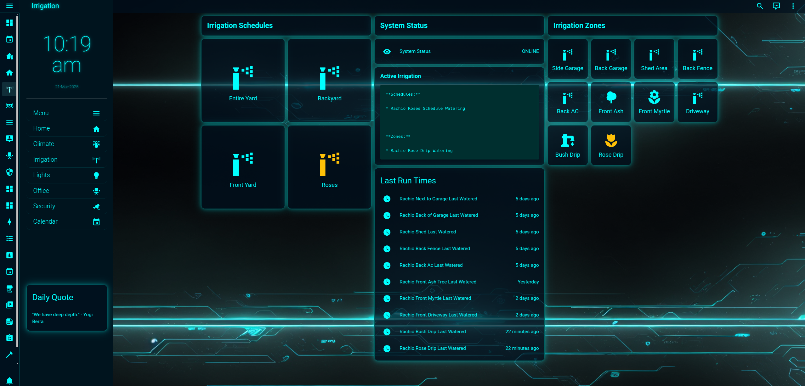

# 🚀 Rachio Local
**Rachio Local** Plugin for Home Assistant is a lightweight integration that enables seamless control and monitoring of Rachio irrigation systems through the Rachio API. By leveraging secure, outgoing API calls, the plugin allows Home Assistant users to retrieve real-time device status, manage watering schedules, control irrigation zones, and receive updates about their Rachio sprinkler system. Unlike traditional integrations that require complex webhook setups, this plugin simplifies connectivity by making direct, authenticated API requests, ensuring a straightforward and secure method of interfacing with Rachio's cloud services without exposing your home network to inbound connections.

---
<p align="center">
  
</p>


---
## 💸 Donations Appreciated!
If you find this plugin useful, please consider donating. Your support is greatly appreciated!

[](https://github.com/sponsors/biofects?frequency=recurring&sponsor=biofects)


[](https://www.paypal.com/cgi-bin/webscr?cmd=_s-xclick&hosted_button_id=TWRQVYJWC77E6)
---


## 🔍 About this Plugin
 **Rachio Local** removes the need to open your home assistant to public network for incoming traffic. Rachio allows 1700 calls a day to API and I have done my best to prevent exhausting them
 Let me break down the API calls under different scenarios:

**Normal Operations (No Active Watering)**
```
Base polling rate: Every 5 minutes
Daily calls = (24 hours × 60 minutes) ÷ 5 minutes = 288 base calls
```
**During Active Watering**
```
Polling increases to every 30 seconds while any zone or schedule is running
Example: For a 2-hour watering schedule
Additional calls = (2 hours × 60 minutes × 2 calls per minute) = 240 calls during that period
```
**Typical Day Example**
```
Base calls: 288
If you run 4 schedules per day:
Each schedule might run for ~2 hours
(4 schedules × 2 hours × 120 calls/hour) = ~960 calls during active watering
The rest of the day uses the 5-minute interval
```
**Estimated Total**
```
Normal day with 4 schedule runs: ~800-1000 API calls
Days with additional manual zone control: Add ~120 calls per hour of manual watering
This is significantly less than your current 1700 calls per day. The reduction comes from:
Using 5-minute intervals during inactive periods
Only using 30-second polling during active watering
```
**Efficient state management with pending operations**
```
Smart handling of schedule and zone transitions
The exact number will vary based on:
How many schedules run each day
Duration of each schedule
How often you manually control zones
Whether schedules overlap
```
---
## Features
- Zone Watering Control: Ability to start and stop individual irrigation zones through switches in Home Assistant.
- Device and Zone Status Sensors: Sensors that provide real-time status of the Rachio device and individual zones, including current watering state.
- Schedule Management: Switches to control and monitor irrigation schedules, allowing start and stop of predefined watering schedules.
- Last Watered Timestamp: Sensors that track and display the last time each zone was watered.
- Periodic Data Polling: Automatic data updates every 5 minutes to keep Home Assistant synchronized with the Rachio device status.

## 🚨 Changelog

### v2.0.1 (2025-06-23)
- Fix: Prevent KeyError if no schedule is running (safe access to schedule id in controller).

### v2.0.0 (2025-06-20)
- Major refactor: Device handler logic split into dedicated files for controllers and smart hose timers.
- Added full support for Rachio Smart Hose Timer devices (valves, battery, last watered, etc.).
- Improved and fixed optimistic timer and state clearing logic for both device types.
- Persistent caching for last watered on smart hose timer.
- Added new diagnostic sensors: battery, paused, on, rain sensor tripped, and schedule status.
- Rain delay control now includes a switch and a dropdown (select entity) for duration.
- Removed connection sensor for smart hose timers (still present for controllers).
- Improved Home Assistant compatibility and removed warnings about device_class/unit_of_measurement.
- Robust error handling and more efficient polling logic.
- All sensors/entities are now registered with the correct handler/coordinator.
- Many bug fixes and code cleanups.

## Notes
My Home Assistant runs in Docker on a server. I don't use the supervised version, nor do I want to expose Home Assistant servers publicly. This is my personal choice, despite it requiring more manual management.
  
  <strong style="color:red;">I don’t know how it works with HAOS.</strong>

- I prioritize securing my network by blocking **phone home** calls from IoT devices, ensuring data privacy, or allowing thrid party webhooks.
- My Home Assistant setup includes an array of devices, with plans to expand further. Here’s a snapshot of what I manage:

    - 💡 Hue
    - 🏠 Tuya
    - 📊 Grafana for monitoring
    - 🎞 Emby for media
    - 🚪 Door locks
    - 🔒 Cameras
    - 💻 Local AI (on server)
    - 🚦 Pi Hole for ad-blocking
    - 🖥 Full network & server monitoring, including GPU & storage
    - 🌀 Fans
    - And much more to come!


## 🚀 Installation Instructions

### HACS (Recommended)

1. Ensure [HACS](https://hacs.xyz/) is installed in your Home Assistant.
2. Open the HACS panel, click the three dots in the top-right corner, and select **"Custom Repositories."**
3. Add the following URL as a **Custom Repository**:  
   [https://github.com/biofects/rachio_local](https://github.com/biofects/rachio_local/)  
   and select **"Integration"** as the category.
5. Click **"Add,"** then navigate to the **"Integration"** tab, click **"+ Explore & Download Repositories"** and search for "Rachio"
6. Install the plugin and restart Home Assistant.
7. Go to **settings Device and Integrations** in Home Assistant and add plugin Rachio Local.
8. You will need to get your API Key from https://app.rach.io/
9. Enter you API Key
---
## Manual installation
1. Create plugin Folder 
    ```
    # Create rachio_local Folder
    mkdir -p /config/custom_components/rachio_local
    ```
2. Copy the files for plugin into your Home Assistant plugin folder
    ```
    
    cp config_flow.py  const.py  __init__.py  manifest.json  sensor.py  switch.py /config/custom_components/rachio_local
    ```

4. Restart Home Assistant


---

## 🐛 Support & Issues
If you encounter bugs or have feature requests, feel free to [open an issue](https://github.com/biofects/rachio_local/issues) on the GitHub repository.

---

## 📜 License
This project is licensed under the MIT License.
